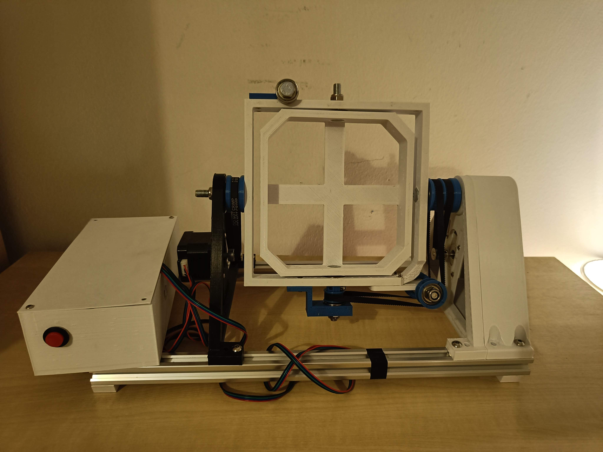

# OpenClino - Open-source 3D clinostat

Open-source 3D clinostat.


<!--  -->

I have provided 3d print files, arduino, and raspberry pi-code. This is a side project for me and is very much work in progress.
It is very difficult to access a 3D clinostat, there are some companies that sell it but can be prohibitively expensive for gravity research.
OpenClino can be built for £100 using off the shelf parts. OpenClino can run in continuous clinorotation or as a random positioning machine.

This is based on the Eorpean Space Agency's work, specifically on Jack Van Loon's clinorotation work [refs].
OpenClino is designed to make use of 3D printing's strengths and requires *no machining* and minimum tools. 
To build OpenClino all the parts are available off the shelf, mainly 3d printer stepper motors, belts, controllers, and skateboard bearings.
All these parts are rated for thousands of hours of operation, and I have fully tested OpenClino to run for a minimum of 100 hrs without fault.

# Documentation

OpenClino is designed to be simple, accessible, affordable, and **reliable**.
I have provided a bill of materials, printing advice, build guide, and code documentation.

links to docs


To run in clinorotation mode simply add these to your arduino's loop function, this will run the x axis at 30 rpm and the y axis at 60:

```cpp
void loop() {
    spin_continuous(30,60);
}
```

Or to run as a random positioning machine, this will run a random walk routine as specified in ESA's work:

```cpp
void loop() {
    RPM();
}
```

# Collaboration

Please contact me [here.](https://research-information.bris.ac.uk/en/persons/abdelwahab-kawafi)

I would be happy to collaborate on this, if you need advice or would like me to print you some parts do not hesitate to get in touch.
