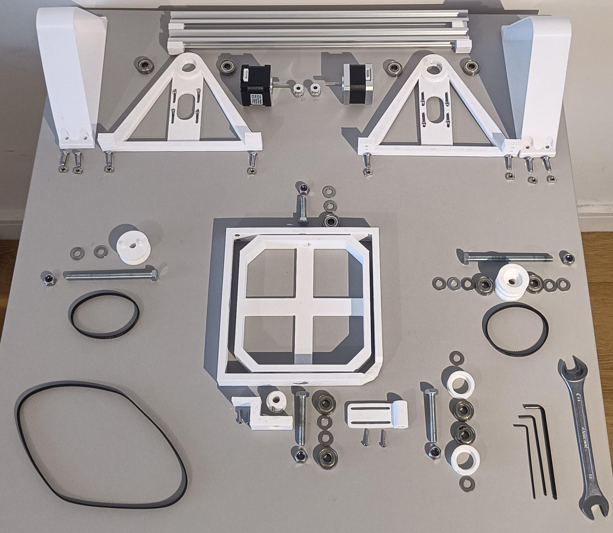

# OpenClino - Open-source 3D clinostat

Open-source 3D clinostat. A clinostat is a small scale [microgravity simulator](https://en.wikipedia.org/wiki/Random_positioning_machine).


This is based on the European Space Agency's work, specifically on [Jack Van Loon's clinorotation work](https://doi.org/10.3389/fpls.2019.01577).

OpenClino is designed to be simple, accessible, affordable, and **reliable**. It is designed to make use of 3D printing's strengths and requires *no machining* and minimum tools. To build OpenClino all non-printed parts are available off the shelf, mainly 3d printer stepper motors, belts, controllers, and skateboard bearings. All these parts are rated for thousands of hours of operation, and I have fully tested OpenClino to run for a minimum of 100 hours.

## Documentation



I have provided:

- Docs in [`docs/1_documentation.md/`](docs/1_documentation.md) including circuit diagram.
- Code in [`src/`](src/openclino.ino)
- Code documentation in [`docs/4_code_documentation.md/`](docs/4_code_documentation.md/)
- 3D print files as .3MF in [`3d_files/`](3d_files/)
- Bill of materials in [`docs/2_BOM.md/`](docs/2_BOM.md/)
- Build guide in [`docs/3_build_guide.md/`](docs/3_build_guide.md/)

## Quick Usage

To run in clinorotation mode simply add these to your arduino's loop function, this will run the x axis at 30 rpm and the y axis at 60:

```cpp
void loop() {
    spin_continuous(30,60);
}
```

Or to run as a random positioning machine, this will run a random walk routine as specified in ESA's work:

> [!WARNING]  
> The RPM function is work-in-progress.

```cpp
void loop() {
    RPM();
}
```

Don't forget to set the output pins for you motor controllers!

## Contributors

[Dan Dragomirescu @dragomda](https://github.com/dragomda)
