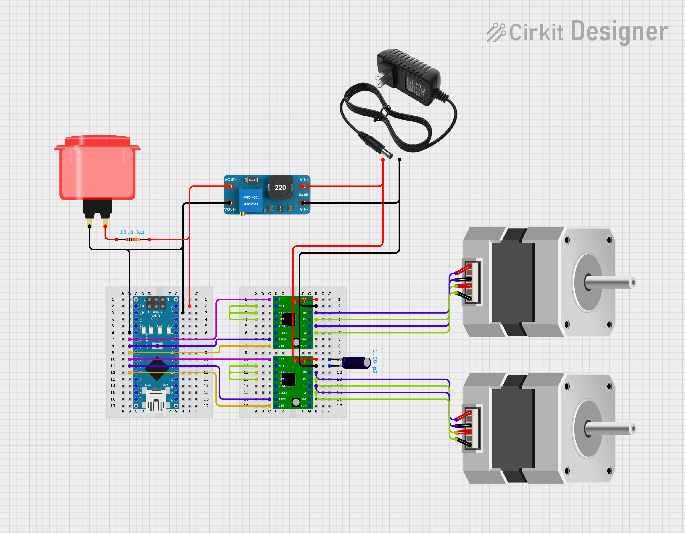

# OpenClino

## Contents list

- [`Bill of Materials`](2_BOM.md)
- [`Build Guide`](3_build_guide.md)
- [OpenClino](#openclino)
  - [Contents list](#contents-list)
  - [Notation](#notation)
  - [Code](#code)

## Design requirements

Clinostats are usually used in biology for plants, cell cultures, and small animals such as fish.

1. OpenClino shall be robust to failures to not harm the animals or samples.
2. Openclino must be simple, accessible, and affordable, requiring no machining.
3. OpenClino should operate in hot and humid environments such as incubators.
4. OpenClino should operate as a clinostat or RPM.

At the moment it is a work in progress.
I'm not an electrical engineer so this is 12v. Be careful with your electronics.
At the moment it functions as a clino but not a true RPM. The motors can't start a new direction or speed independently.
You can buy waterproof nema17s and have the electronics outside of the incubator if needed.

TODO material requirements

## Notation

TODO make a figure defining part names

Definitions:
motor_pulley
x_pulley
y_pulley
m2y pulley
y_turn
y_turn_pulley
y_guide
motor_mount
motor_enclosure
which is x and y

## Code

The code is work in progress, it requires the following:

- control multiple motors separately.
- acceleration.
- docs.
- Implementing the airbus algorithm for variable G.

### Usage

To run in clinorotation mode simply add these to your arduino's loop function, this will run the x axis at 30 rpm and the y axis at 60:

```cpp
void loop() {
    spin_continuous(30,60);
}
```

Or to run as a random positioning machine, this will run a random walk routine as specified in ESA's work:

```cpp
void loop() {
    RPM();
}
```

Don't forget to set the output pins for you motor controllers!

# Circuit design

This is a very simple arduino circuit with a button and 2 stepper motor controllers.

TODO add quiet motor controller


