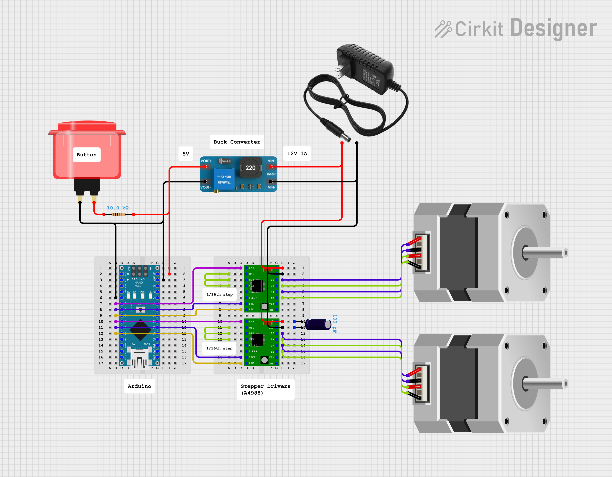

# OpenClino

It is very difficult to access a 3D clinostat, there are some companies that sell it but can be prohibitively expensive for gravity research. OpenClino can be built for £100 using off the shelf parts. OpenClino can run in continuous clinorotation or as a Random Positioning Machine (RPM).

> [!CAUTION]  
> Since Version 0.3.0 remember to run the [calibration procedure](#usage--calibration).

## Definitions

- X body is the outer body. 
- Y body is the inner body.
- Motor pulleys attach to the motor.
- X/Y pulleys attach to the body.
- The "`m2y`" pulley is the one with 2 belts attached.
- The "`y_turn`" is the bearings bending the long y belt.
- The "`y_guide`" is the L shaped bracket holding the y pulley.

# Circuit design

This is a very simple arduino circuit with a button and 2 stepper motor controllers.

I base the circuit on [this great article by lastminuteengineers](https://lastminuteengineers.com/a4988-stepper-motor-driver-arduino-tutorial/]).



## Code

[OpenClino Documentation.](4_code_documentation.md)

### Usage & Calibration

To calibrate the Y-axis correction factor, follow these steps:

1. Upload the code to your Arduino.
2. Open the Serial Monitor in the Arduino IDE.
3. Center the frames so that they are overlapping.
4. Press the button connected to the Arduino to start the calibration process.
5. The Y-axis motor will rotate by 360 degrees.
6. The Serial Monitor will prompt you to enter the actual degrees the Y-axis rotated.
7. Enter the measured degrees in the Serial Monitor and press Enter.
8. The new Y-axis correction factor will be calculated and displayed in the Serial Monitor.
9. Manually update the `yCorrection` variable in the code with the new correction factor.

Example:

```cpp
double yCorrection = 1.5; // Update this value with the new correction factor
```

> [!WARNING]  
> You might have to run the calibration a couple of times to get the right correction. The effect of the outer body on the inner body is dependant on friction in the system which is widely variable. If you are struggling to calibrate your clinostat please raise an issue on Github,

Now your clinostat is ready to use! To run in clinorotation mode simply add these to your arduino's loop function, this will run the x axis at 2 RPM and the y axis at 4:

```cpp
void loop() {
    spin_continuous(2,4);
}
```
